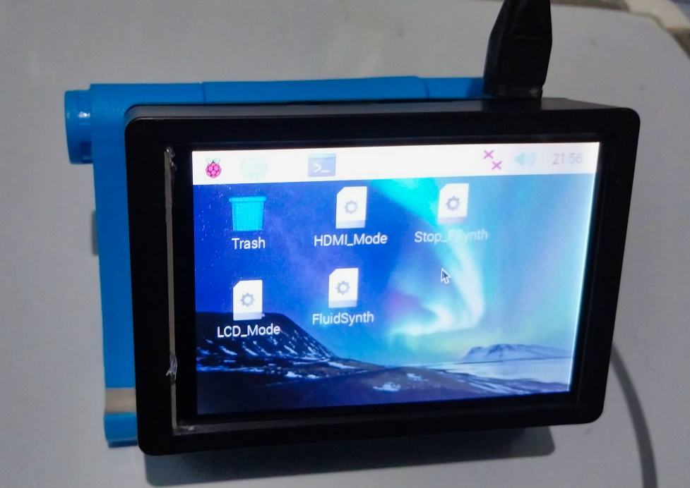

In this tutorial, I will explain how I created a MIDI sound module using a Raspberry Pi.

<!--more-->

Now, before we dive in, let's first define some key terms we will be using:

- [MIDI](https://en.wikipedia.org/wiki/MIDI) (Musical Instrument Digital Interface) is a protocol that allows electronic musical instruments, computers, and other devices to communicate with each other. A MIDI sound module is a device that generates sounds based on MIDI messages sent to it.
- [Raspberry Pi](https://en.wikipedia.org/wiki/Raspberry_Pi). A credit-card-sized computer that can be used for a variety of projects. It can be connected to an external USB as powersource
- USB MIDI interface: A device that connects MIDI devices such as a computer via USB. Some may appear like keyboards or even pads.
- [FluidSynth](https://www.fluidsynth.org/): A software synthesizer that uses SoundFont files to generate audio.
- [Soundfont](https://en.wikipedia.org/wiki/SoundFont) - You can this of these as a database of recorded samples from played instruments. The most common soundfont is [General MIDI](https://en.wikipedia.org/wiki/General_MIDI) which is also included with FluidSynth.

## Components Used

### Hardware

- Raspberry Pi 3B+ (newer models would be better but not required)
- MIDI Keyboard Controller
- 3.5 inch Touch Screen (optional)
- 32GB MicroSD Card

### Software

- [Raspberry OS](https://www.raspberrypi.com/software/) (aka Raspbian OS)
- FluidSynth

## Instructions

### Installing the Required Softwares

_I will be assuming you have Raspberry OS installed on your microSD card already. If you haven't, I suggest checking the [documentation](https://www.raspberrypi.com/documentation/computers/getting-started.html#installing-the-operating-system)._

On your Raspberry PI, open the terminal and enter the following commands

```bash
sudo apt-get install fluidsynth
```

This will install Fluidsynth.

You can now run fluidsynth on your terminal by entering the next command:

```bash
fluidsynth -a alsa -g 5 /usr/share/sounds/sf2/FluidR3_GM.sf2
```

What this basically does is it will start a server that will be using the General MIDI Soundfont file (FluidR3_GM.sf2) with a 5 audio gain.

### Configure the MIDI Device.

Connect the MIDI Device. Open another terminal window or tab then enter the following commands:

```bash
aconnect -o
```

An output will appear that should contain the data we need for connection

```
$ aconnect -o
client 14: 'Midi Through' [type=kernel]
    0 'Midi Through Port-0'
client 24: 'Keystation Mini 32' [type=kernel,card=2]
    0 'Keystation Mini 32'
client 128: 'FLUID Synth (1233)' [type=user,pid=1233]
    0 'Synth input port (1233:0)'
```

The values may differ on your machine. I'm using an MAudio Keystation Mini 32 Keyboard. As shown in the output, `24` is assigned to the keyboard while . client `128` is assigned to the FluidSynth application.

Connect the MIDI device to FluidSynth by running the following command:

```bash
aconnect 24:0 128:0
```

If there are no errors messages, you should be able to hear a sound when you play the keyboard.

### Putting it all Together

Now we are able to connect FluidSynth to the keyboard, we should be making a script that will perform all the commands we did earlier.

On a text editor (like Geany), create a bash script that contains the following

```bash
#!bin/bash
fluidsynth -is --audio-driver=alsa --gain 5 /usr/share/sounds/sf2/FluidR3_GM.sf2 &

sleep 5

aconnect 24:0 128:0

```

Save it as let's say `start_synth` on an accessible directory. Make it an executable with the `chmod` command.

```bash
chmod +x start_synth.sh
```

Now whenever we need to start fluidsynth we will have to enter

```bash
./start_synth
```

### Adding an LCD Touchscreen (Optional)


To eliminate the need of a monitor and keyboard/mouse I have added a 3.5 touchscreen I got from Alibaba. For generic touch screens, more information can be found on this [repository](https://github.com/goodtft/LCD-show). I suggest checking this first before purchasing one to check for compatibility.

With this setup, I have placed the start_synth file I've created on the desktop and in order to start FluidSynth I just have to double tap the script then execute to make it play. The driver also allow you to rotate the screen which also comes in handy.

To stop fluidsynth, I've created another script containing the following commands

```
killall fluidsynth
```

## Conclusion

I have explained how to create a MIDI sound module using a Raspberry Pi. With this setup, you can generate high-quality instrument sounds from MIDI files and control them using your USB MIDI interface such as keyboard. This can be a great project for musicians, music producers, and anyone interested in exploring the world of MIDI music and making Raspberry PI projects as well.

## Suggested Further Reading:

- [Fabacademy Raspberry PI Tips on FluidSynth](https://fabacademy.org/2020/labs/kannai/students/tatsuro-homma/project/RaspPi_S_03_fluidsynth.html)
